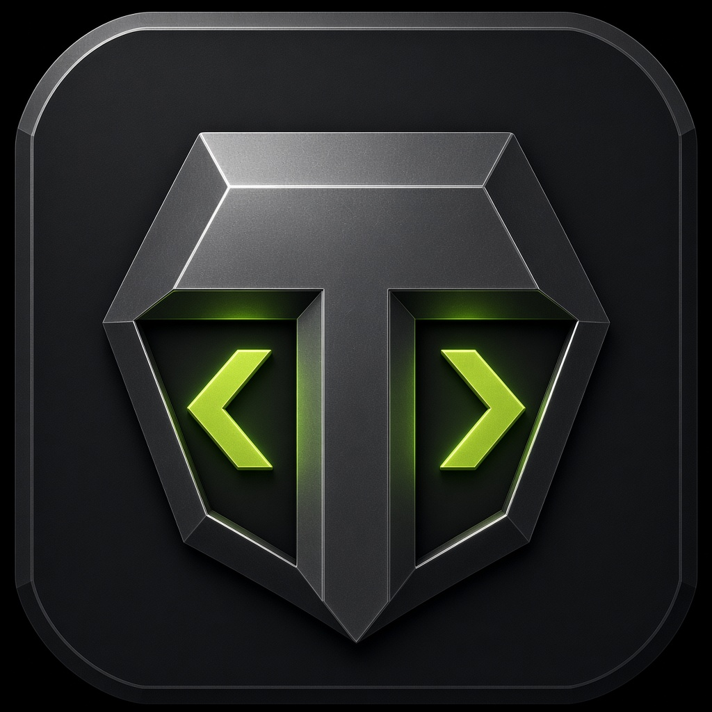

# Tungsten IDE 2.2

A rugged, installable development environment built with Electron, React, Monaco, xterm, Language Server Protocol, Debug Adapter Protocol, SSH, and Yjs. Tungsten targets Windows, macOS, and Linux while retaining a safe browser workspace for development and demonstrations.



## Tungsten 2.2 highlights

- Full merge and rebase controls with operation detection, conflict lists, three-stage conflict loading, side-by-side current/incoming review, resolution actions, continue, and abort
- Remote LSP and DAP adapter processes over the active SSH transport, plus remote project detection, tasks, structured tests, commands, and LCOV loading
- Editable, persistent keyboard shortcuts with collision handling and platform-aware labels
- Inline DAP variable values beside the stopped source line
- Managed extension lifecycle with persisted enable/disable state, user-package uninstall, scope visibility, permission display, and isolated host reactivation
- **Graphene**, Tungsten's own design language, generated from a single token file and shipped as the default appearance
- **Real editor groups**: split right or down up to four ways, each group with its own tab strip, breadcrumbs and Monaco instance, with drag-and-drop between splits
- The Tungsten 2.1 performance, multi-root, terminal, Git hunk, testing, and collaboration improvements remain included

See the [Tungsten 2.2 release notes](docs/RELEASE_2.2.md) and [2.1 performance notes](docs/RELEASE_2.1.md).

## Tungsten 2.2 workstation

### Editing and workspace engine

- Monaco editing for more than 40 languages and formats, with tabs, minimap, sticky scopes, formatting, autosave, accessible editor modes, and side-by-side preview
- Editor groups modelled on VS Code's group service: split horizontally or vertically (four groups maximum), preview and pinned tabs, close-others/close-to-the-right, move editors between groups by dragging, join all groups, and focus-follows-caret so the pane you type in becomes the active one
- Native Chokidar workspace watching with external-change indication across persisted multi-root local workspaces
- Ripgrep-backed asynchronous content search across every local root, with bounded in-process and remote fallbacks
- Bounded, lazy folder rendering; ignored dependency/build trees; 2 MB per-file and 4,000-file desktop safety limits
- Quick-open, symbol outline, command palette, dashboard, workspace profiles, settings, editable persistent keybindings, recovery snapshots, and responsive resizable panels

### Language intelligence

The generic multi-root LSP client supports completion, hover, diagnostics, go-to-definition, references, rename/workspace edits, signature help, code actions, semantic tokens, and live `workspaceFolders` updates.

- TypeScript/JavaScript language service is included
- Python, Rust, Go, C/C++, Java, C#, Ruby, PHP, Kotlin, and Lua servers are detected from `PATH`
- Syntax editing remains available if an optional external server is absent

See [Language servers](docs/LANGUAGE_SERVERS.md).

### Industrial terminals and debugging

- Persistent PTY terminal tabs and layouts, split views, buffer search, per-tab restart, dedicated task terminals, WSL profiles, Docker profiles, and interactive SSH shells
- DAP launch/configuration lifecycle with gutter breakpoints, conditional breakpoints, threads, call stacks, scopes, variables, inline stopped-line values, watches, continue, pause, step-over, step-in, and step-out
- Project launch configurations under `.tungsten/launch.json`

See [Debugging](docs/DEBUGGING.md).

### Testing and coverage

- Project test-profile detection for npm, pytest, Cargo, Go, Maven, and Gradle
- Individual test discovery for JavaScript/TypeScript, Python, Go, and Rust
- Per-test open, structured run, and debug-terminal actions with pass/fail state, duration, failure excerpts, and snapshot output
- LCOV parsing with editor gutter/overview coverage overlays
- Unit, desktop bridge-contract, production HTTP E2E smoke, and workspace benchmark commands

### Git and GitHub

- Branch/worktree status, side-by-side diffs, line-hunk and whole-file staging/unstaging, commits, checkout, and conflict visibility
- Commit graph/history, stash push/pop, blame buffers, and complete merge/rebase workflows with conflict resolution, continue, and abort
- GitHub pull-request and issue lists through the authenticated `gh` CLI

### Extension host

- Per-user and workspace package discovery
- Declarative commands, themes, languages, keybindings, and sidebar metadata
- Separate extension-host process for executable packages
- Restricted VM API, activation/command timeouts, permission review, SHA-256 entry-point verification, persisted enable/disable state, and managed uninstall

See [extension packages](docs/EXTENSIONS.md).

### Remote development and collaboration

- SFTP-backed SSH workspaces with safe file operations, indexed search, remote terminals, project/task/test detection, LCOV, and SSH-hosted LSP/DAP processes
- WSL distribution, Docker container, and Dev Container detection with dedicated terminal profiles
- Yjs shared documents over token-protected WebSocket rooms
- Visible collaborator cursors, presence, review comments, reconnection-ready room events, and voice-room signaling foundations

See [remote development and collaboration](docs/REMOTE_AND_COLLABORATION.md).

### Product and release engineering

- Welcome dashboard, settings presets, accessibility controls, reduced motion, high contrast, and screen-reader editor mode
- Telemetry disabled by default and explicit crash-report preference
- Context-isolated, sandboxed Electron renderer; narrow typed preload bridge; path/symlink protection; isolated previews
- Automatic packaged-app updates and Windows NSIS/portable, macOS DMG/ZIP, and Linux AppImage/DEB targets
- GitHub Actions cross-platform installer builds with optional signing/notarization secrets and generated release notes

## The shell dictionary

Tungsten ships a dictionary of **592 shell commands** and answers questions
about them in three places: the **Shell Dictionary** view in the activity bar,
the terminal prompt, and the command palette.

```bash
man tar                 # the full page: synopsis, flags, examples, see also
apropos compress        # search every summary, flag table and example
whatis jq               # the one-line description
explain sudo rm -rf /var/cache    # read a whole command line back in English
```

`explain` is the reason the dictionary exists. It splits a line on the operators
that change its meaning — respecting quotes, so a pipe inside a string stays a
pipe character — resolves each command against the dictionary, expands bundled
short flags (`-la`) and dashless clusters (`tar czf`), follows wrappers through
to what they will actually run (`xargs -0 rm -f` warns about the `rm`), and
names every redirection. Anything it does not recognise is reported rather than
guessed at.

The terminal is dictionary-aware throughout: a hint under the prompt explains
what you are typing as you type it, a command the browser sandbox cannot run is
answered with what the dictionary knows about it instead of a dead end, and a
typo is met with the nearest match — the distance metric counts a swapped pair
of letters as one mistake, so `gti` finds `git`.

A workspace can document its own commands. Drop JSON into `dictionary/`:

```
dictionary/team.commands.json   →   { "commands": [ { "name": "deploy", ... } ] }
```

Those entries are read as data — nothing in the file is ever evaluated — and
merged into the same index, so the sidebar, `man`, `apropos` and `explain` all
answer for them. A workspace entry may also override a built-in one. The
palette command **Shell Dictionary: Document a Command for This Workspace**
writes a worked example to start from.

`src/shell/` holds it: `commandModel.ts` (the shape of an entry), `data/` (the
entries, by subject), `commandDictionary.ts` (the index, search, suggestions and
the manual renderer), `explainShell.ts` (the command-line reader) and
`workspaceCommands.ts` (the loader). `src/shell/commandDictionary.test.ts`
treats the data as something to be verified, not trusted: no duplicate names, no
cross-reference to a page that does not exist, no entry pointing at itself,
every synopsis actually invoking the command it documents.

## A real terminal in the browser

The desktop build spawns a PTY in the Electron main process. The browser build
now gets the same thing: `server/shellPlugin.ts` is a Vite plugin that hosts
real `node-pty` processes behind a WebSocket at `/__tungsten/pty`, and
`src/terminal/ptyClient.ts` presents that socket to the workbench through the
identical API the Electron bridge exposes. `DesktopTerminal` — xterm, fit,
search, scrollback — does not know which one it is driving.

So the terminal in a browser tab is bash. Not an emulation of bash: the shell
on the machine, with job control, colour, a working `cd`, your environment,
`git`, `node`, `python3`, `vim`, `top`, and every other binary on `PATH`.

| Host | Used when | What runs |
| --- | --- | --- |
| Electron PTY | the desktop app | `node-pty` in the main process |
| Socket PTY | `npm run dev` / `npm run preview` | `node-pty` in the Vite server |
| Emulated shell | a static production build | `src/terminal/sandboxShell.ts` |

The workbench probes `/__tungsten/shell/health` once at startup and picks the
best host available, so the same bundle degrades to the emulated shell when
there is nothing to attach to.

Each shell starts from a generated rc file that sources your own config first
and then adds Tungsten's dictionary, so `man`, `whatis`, `apropos` and
`explain` work inside the real shell — on a container with no man pages
installed, `man rsync` still answers.

### What keeps this safe

Handing a browser tab a shell is not a small thing, so:

- the plugin is `apply: 'serve'` — it exists during `vite dev` and
  `vite preview` and is **never** part of a production bundle; the built
  `dist/` contains no server, no `ws` and no `node-pty`
- sockets whose `Origin` is not the page being served are refused, so another
  site open in the same browser cannot reach your shell
- `TUNGSTEN_SHELL=off` disables it, and the startup banner always says which
  shell you got
- input is capped, terminal dimensions are clamped, at most twelve shells may
  be open at once, and closing a tab kills its process

`server/shellPlugin.test.ts` boots a real server and drives it the way the
browser does: probe, connect, start bash, run `echo`, check that `cd /tmp`
persists into the next command, read a manual page through the shell function,
and confirm a foreign origin is turned away.

## Graphene, the design language

`src/theme/tokens.json` is the single source of truth for how Tungsten looks: the
neutral ramp, the one lime accent, the signal hues, the syntax palette, the type
scale and the geometry. Nothing else hard-codes a colour.

```bash
npm run graphene            # regenerate the theme and the stylesheet variables
npm run graphene -- --check # fail if either output is stale (runs inside `npm run check`)
```

Two artefacts are derived from it and must never be hand-edited:

- `src/theme/graphene.generated.ts` — a `TungstenTheme` the runtime service applies
  to the workbench, Monaco and xterm in one pass.
- the `:root` token block in `src/styles.css` — the first-paint fallbacks, which
  have to equal the runtime values or the window flashes on launch.

The ten imported VS Code themes remain available in the picker; Graphene is simply
the one the product ships as. Tests in `src/theme/graphene.test.ts` enforce the
invariants that make it a design system rather than a palette: WCAG contrast floors
computed with the app's own implementation, a monotonic neutral ramp, a single
accent across every primary affordance, and the absence of any stock VS Code blue.

## Run the desktop app

```bash
npm install
npm run desktop:dev
```

A graphical desktop session is required. External tools such as Git, ripgrep, `gh`, Docker, language servers, and debug adapters are detected and integrated when installed; Tungsten does not silently bundle those ecosystems.

## Browser development

```bash
npm run dev
```

The Vite server binds to `0.0.0.0`. Browser mode includes the editor and simulated local workspace. Native filesystem, PTY, Git, LSP/DAP processes, SSH, executable extensions, collaboration hosting, and updates remain behind Electron's preload boundary.

## Build installers

```bash
npm run desktop:dist
```

Installers are written to `out/`. Build on each target OS or use the included `Build desktop installers` GitHub Actions workflow. Optional signing environment variables are documented in the workflow. Create an unpacked current-platform app with `npm run desktop:pack`. See the [laptop testing guide](docs/LAPTOP_TESTING.md) for installation notes and the acceptance checklist.

## Workbench structure

`src/App.tsx` owns workbench state — the workspace, the editor group layout, debug and terminal sessions — and nothing else. Everything it renders lives in its own component and receives data and callbacks as props:

| Area | Components |
| --- | --- |
| Editor | `components/EditorGroup.tsx`, `components/ConfiguredEditor.tsx`, `components/Preview.tsx` |
| Sidebar | `components/sidebar/` — `ExplorerView`, `SearchView`, `SourceControlView`, `DebugView`, `TestingView`, `ExtensionsView`, `DictionaryView` |
| Panel | `components/panel/` — `ProblemsPanel`, `TerminalPanel`, `DesktopTerminal` (xterm over a PTY) |
| Chrome | `components/TitleBar.tsx`, `components/StatusBar.tsx`, `components/ActivityBar.tsx`, `components/panel/PanelHeader.tsx`, `components/ContextMenu.tsx` |
| Dialogs | `components/dialogs/` — command palette, theme picker, settings, settings editor, snippets, keyboard shortcuts, collaboration, remote, new project, new file |
| Shared | `components/Modal.tsx`, `components/FileGlyph.tsx`, `components/TipButton.tsx`, `components/Highlight.tsx` |

The same pattern holds for every other long-running concern: `src/search/` (the query, its options, the desktop's ripgrep pass and replace-all), `src/collaboration/` (a room's people, their cursors and the comment thread, folded in by pure rules), `src/project/` (tasks, tests, coverage and installed extensions, re-read whenever the workspace changes), `src/remote/` (SSH, WSL and container connections), `src/languages/` (the Monaco providers, and the diagnostics each server publishes, merged per file), `src/workbench/` (which view is showing, and how big the side bar and panel are) and `src/configuration/` (every preference, as the one store both settings dialogs edit) are services too.

The same pattern holds for the other long-running concerns. `src/debug/` runs the debug session: `debugModel.ts` is the Debug Adapter Protocol as a pure reducer — a message and the current session in, the next session and the requests it implies out — and `useDebugSession.ts` adds the adapter process, breakpoint path resolution and the watch expressions. `src/terminal/` owns the panel's sessions: `terminalSessions.ts` holds the tab-strip rules and the layout that survives a reload, `sandboxShell.ts` is the browser build's emulated shell, and `useTerminalSessions.ts` decides between a real child process and that shell.

Git is a service rather than a pile of state: `src/git/useGitService.ts` owns status, history, branches, stashes, staging, commits, diffs, blame and conflict resolution, and is the only caller of the Git bridge. Its state is stamped with the workspace root it describes, so opening another folder shows empty Git state at once and a late reply for the old root is discarded. The pure parts — status codes, the merge of Git's view with unsaved buffers, and the naming of the `.tungsten/` diff, conflict and blame documents — live in `src/git/gitModel.ts`. The browser build's emulated shell is likewise pure: `src/terminal/sandboxShell.ts` turns a command and a workspace snapshot into output lines.

Every dialog is built on one `Modal` shell, so backdrop dismissal, Escape, the dialog role and an accessible name are implemented once and none can be missing. The title bar renders a menu model the workbench resolves from the command table, so a menu entry cannot disagree with the command it invokes.

None of these components reads `localStorage` or calls `window.tungsten`: desktop capability arrives as a prop, so every view renders in the browser build and in jsdom. `src/components/views.test.tsx` and `src/components/dialogs.test.tsx` mount each one and drive it, and `src/platform.test.ts` enforces the boundary.

## Extending Tungsten

Four extension points, all read from the workspace you have open:

| I want to… | Put a file here | Runs code? |
| --- | --- | --- |
| Add a block to the visual builder | `plugins/*.block.json` | no — it is a template |
| Add a block that needs real logic | `src/builder/blockLibrary.ts` via `defineBlock` | yes, it is app source |
| Document a shell command | `dictionary/*.commands.json` | no — it is data |
| Add IDE commands, languages, themes | `extensions/<id>/extension.json` | only if you opt in |

Full worked examples, the field reference and the failure messages are in
**[docs/PLUGINS.md](docs/PLUGINS.md)**. The visual builder's specification and
where each part of it is implemented is in **[docs/BLUEPRINT.md](docs/BLUEPRINT.md)**.

## Validation

```bash
npm run check
npm run test:e2e
npm run bench:workspace
npm audit
```

`check` verifies the Graphene outputs are current, then runs ESLint, Vitest, TypeScript, and the production Vite build. The E2E smoke boots the production server and validates its shell and application bundle. The benchmark reports indexed files, bytes, throughput, elapsed time, and heap use.
